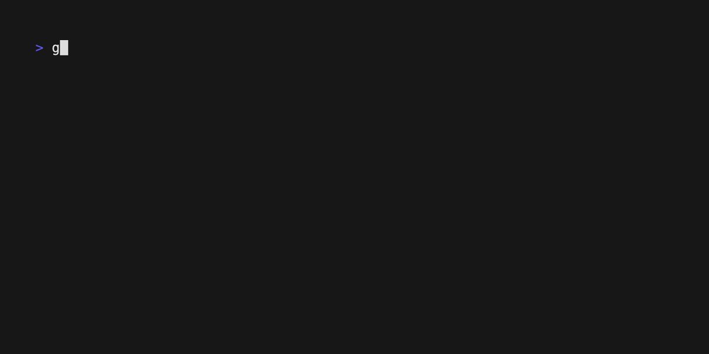

# Glitter

Add dynamic [bubbbletea](https://github.com/charmbracelet/bubbletea)
elements to existing Go applications.

## Why should you use Glitter?

- You have a useful application with a pragmatic command line interface. It
doesn't matter if it is complex and uses
[cobra](https://github.com/spf13/cobra) or if it is simple and uses
[flag](https://pkg.go.dev/flag).

- You already have set in place some logging mechanism. It doesn't
matter if you are using [log](https://pkg.go.dev/log), 
[zerolog](https://github.com/rs/zerolog) or any other logging mechanism as long
as it supports specifying it's output as an `io.Writer`.

- You want to add some dynamic elements. A simple progress bar or something way
  more complex.

Add some Glitter to your application! With all the flexibility of
[bubbbletea](https://github.com/charmbracelet/bubbletea) but without its
complexity. As simple as two lines of code:

```go
program := glitter.NewProgram(spinner.New()).GoRun()
defer program.QuitAndWait()
```

## Examples

### Cobra & Spinner
Long running commands often require logging some intermediate information to
let users know that the program is running as expected. However, printing a
bunch of debug logs does not look nice in an application. Spinners can make
your application more user friendly and `glitter` integrates them painlessly
with your `cobra` application.

[connect.go](./examples/cobra/cmd/connect.go)
```golang
var connectCmd = &cobra.Command{
	[...]
	Run: func(cmd *cobra.Command, args []string) {
        // Create and run a spinner in the background
		program := glitter.NewProgram(spinner.New()).GoRun()
		defer program.QuitAndWait() // Quit when command ends

		// Set the command output to the program
		defer func(w io.Writer) { cmd.SetOut(w) }(cmd.OutOrStdout())
		cmd.SetOut(program)
        [...]
    }
}
```



### Log & Progress
Log info


### TODO Example with huh? prompt and Charm's Log

### TODO Example with zerolog

### Charm's Log & Prompt

## Pre-defined models
Glitter extends [bubbles](https://github.com/charmbracelet/bubbles) with some
pre-defined models for fast prototyping:

- TODO: Progress with title and ETA.
- TODO: Spinner with title.

These models are usable out of the box and quit after pressing usual quit key
combinations (`ctrl+C`/`cmd+C`). They are intended to cover basic dynamic
elements that one would like to add to an existing application. 

However they are just the tip of the iceberg of what can be done with
Bubbletea and you might want a custom element. We also provide a `WrapModel`
function that will wrap your custom model to make it behave better with an
existing application (e.g. quitting with `ctrl+C`/`cmd+C`).